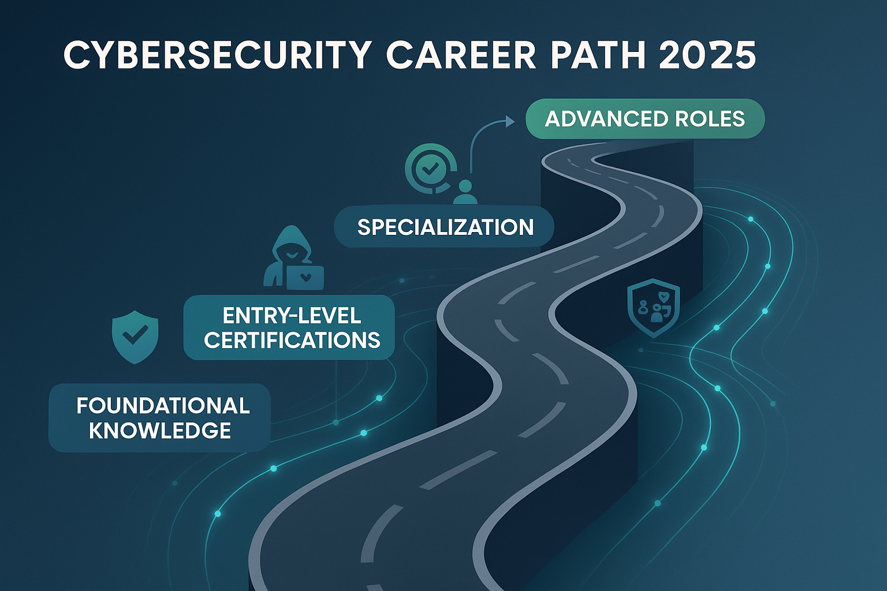
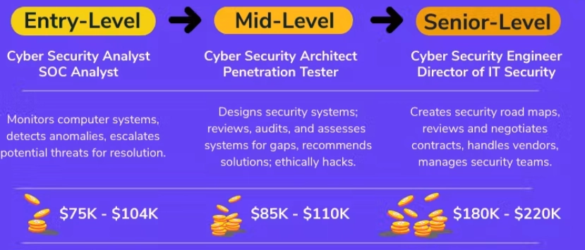

# Cybersecurity Workshop - Day 1

## 1. Introduction to the Workshop

### 1.1 The Cybersecurity Career Roadmap

Cybersecurity is not just one job, it's a whole ecosystem of roles. A cybersecurity career roadmap **starts with IT and networking foundations, moves into hands-on technical skills, and branches into specialized security roles**.

Quick tour of where people usually start and where they go:

|  | What they actually do | Entry point |
| --- | --- | --- |
| **SOC Analyst** | Watches alerts 24/7, triages incidents, first responder | Most common entry-level role |
| **Penetration Tester** | Gets paid to legally hack companies before criminals do | Usually 2-3 yrs experience + certs (OSCP, CEH) |
| **GRC / Compliance** | Makes sure the company follows security laws & frameworks (ISO 27001, NIST) | Good fit for non-technical/business-minded people |
| **Cloud Security** | Locks down AWS/Azure/GCP environments | Growing fast, high demand |
| **Incident Response** | The "fire department" - called in when a breach actually happens | Senior-track, high pressure, high pay |

     *You **don't** need to code to work in cybersecurity!!  GRC and awareness roles are just as real.*

Cybersecurity is a contact sport. Every single day, somewhere in the world, attackers and defenders are fighting over the same systems, and by the end of tomorrow, you'll have played both sides of that fight yourself!

**Real example: The 2017 Equifax breach -** One of the most damaging breaches in history. Exposed data on ~159 million Americans.

- Cause: An unpatched vulnerability in a web software component (Apache Struts).
- Attackers sat undetected inside the network for over **two months.**
- Exposed: Social Security numbers, birth dates, addresses, driver's license numbers, and **~209,000 credit card numbers**.

- Why it matters: Equifax is a major credit agency. The stolen data was directly tied to people's financial identity, fueling long-term identity theft risk

One unpatched update took down a company holding financial data on half the US population. This isn't Hollywood hacking - it's **one missed patch**.

So what actually goes wrong in breaches like this? That's what we're breaking down next.

## 2. Security Fundamentals

### 2.1 The CIA Triad: A foundational information security model

Every security concept boils down to protecting three things:

| Pillar | Means | Real breach example |
| --- | --- | --- |
| **Confidentiality** | Only the right people can see the data | Data leak exposing customer passwords |
| **Integrity** | Data can't be secretly changed | Attacker altering a bank transaction amount mid-transfer |
| **Availability** | Systems stay up and usable | A DDoS attack knocking a website offline |

### 2.2 Four Terms Everyone Mixes Up

- **Vulnerability:** a weakness (an unlocked door)
- **Threat:** someone who could exploit it (a burglar)
- **Risk:**  likelihood × impact if it happens
- **Exploit:**  the actual method used to break in

### 2.3 Attack Surface

Everything an attacker could touch: endpoints, APIs, people, third-party vendors. If it's connected, it's exposed.

### 2.4 Threat Actors:  Who's Actually Attacking

| Actor | Motive |
| --- | --- |
| Script kiddies | Bragging rights |
| Hacktivists | Ideology |
| Organized crime | Money |
| Nation-state / APT | Espionage, sabotage |
| Malicious insiders | Grudge, money, mistake |

*The motive changes the whole threat model. A bored teenager and a nation-state don't attack the same way.*

### 2.5 CVE & CVSS

When a vulnerability is discovered, it gets a public ID (CVE) and a severity score (CVSS), so the whole industry can talk about the same flaw.

### The Human Factor

The weakest link is rarely the firewall. **It's people.**

The **UAE Cyber Security Council** has reported that over 75% of cyber breaches in the UAE start with phishing emails and fraudulent messages, not complex technical hacks, but tricking a person into clicking or replying. The Council points to **human behavior as the weakest link**, more than any technical flaw.

Locally, the **Dubai Electronic Security Center (DESC)** runs public awareness campaigns for exactly this reason, warning residents about evolving scam tactics that use fake images, videos, and voices to spread misleading or malicious content, and urging people to verify before they click or share.

Firewalls can't stop someone from typing their password into a fake login page. That's why the UAE's own cybersecurity bodies spend as much energy on public awareness as they do on technical defense.

*Security is everyone's job - same way 'shared responsibility' trips up people new to cloud computing. The tools only work if the humans using them do too.*

## 3. Red Team vs. Blue Team, Side by Side

**Mindset & goals:**

- Attacker: find *one* way in
- Defender: cover *every* way in
- Purple team: make both sides talk to each other

### 3.1 Tooling, Mapped Side by Side

| Attack Move | Defensive Move |
| --- | --- |
| **Recon:** OSINT, Shodan | Attack surface management |
| **Exploitation:** Metasploit, manual exploits | Patch management, EDR |
| **Password attacks:** hashcat, credential stuffing | MFA, password policy, rate limiting |
| **Social engineering:** phishing kits | Security awareness training, email filtering |
| **Persistence & lateral movement** | Network segmentation, least privilege |

### 3.2 Kill Chain Walkthrough

Every attack tends to follow the same seven steps:

          **  *Recon → Weaponize → Deliver → Exploit → Installation → C2 → Actions on Objectives***

| Attack Stage | Defensive Control |
| --- | --- |
| **Reconnaissance** | Limit public info exposure (LinkedIn oversharing, exposed metadata) |
| **Weaponization** | Can't be blocked directly (happens off-network), but threat intel feeds help predict incoming techniques |
| **Delivery** | Email filtering, spam gateways, USB port controls |
| **Exploitation** | Patch management, endpoint hardening |
| **Installation** | EDR/antivirus, application allowlisting |
| **Command & Control (C2)** | Network monitoring, DNS filtering, egress traffic restrictions |
| **Actions on Objectives** | Data loss prevention (DLP), backups, incident response plan |

*Attackers don't need to win every stage, defenders just need to break the chain at one link.*

### 3.3 Career Paths

| Path | Day-to-day |
| --- | --- |
| Pen-tester / Red teamer | Actively attacks systems (legally) to find gaps |
| SOC Analyst / Blue teamer | Monitors, detects, and responds to real-time threats |
| GRC | Ensures policies, audits, and compliance are met |

*Different day-to-day, same mission: keeping the organization safe.*

## 4. Web Application Security: OWASP Top 10

**Web apps are the #1 attack surface:** always on, always public, and running on huge, messy codebases. 

### 4.1 OWASP Top 5

| Vulnerability | In one line |
| --- | --- |
| **Injection (SQLi)** | Sneaking commands into a data query |
| **Broken Authentication** | Weak or bypassable login systems |
| **Cross-Site Scripting (XSS)** | Tricking a browser into running attacker code |
| **Broken Access Control** | Getting access to things you shouldn't see |
| **Security Misconfiguration** | Default passwords, exposed settings, unpatched servers |

### 4.2 SQL Injection, Conceptually

**Expected query:**`SELECT * FROM users WHERE user='bob' AND pass='1234'`

**Attacker input in the password field:** `' OR '1'='1` 

**What the database actually runs:**`SELECT * FROM users WHERE user='bob' AND pass='' OR '1'='1'`

Since `'1'='1'` is always true, the login check passes - no valid password needed.

### 4.3 XSS, Conceptually

-Tricking the browser into running someone else's script instead of trusting the page. Instead of stealing data from the *server*, XSS targets whoever's *viewing* the page.

#### Your Browser Is Already a Hacking Tool

- **Inspect Element / View Source:** see the raw code behind any page.
- **Network tab:** watch every request a page makes, including hidden ones.

No installs needed, recon starts with tools already built into Chrome/Firefox.

### 4.4 Cookies & Sessions

A stolen session token = a stolen identity. If an attacker grabs your session cookie, they don't need your password, they just *become* you to the website.

#### HTTPS / TLS

The padlock icon only proves the connection is **encrypted,** not that the site is **trustworthy**. Phishing sites can (and do) have valid padlocks too.

## 5. Social Engineering & Human Hacking

**Why humans get targeted:** it's cheaper and scales better than trying to break firewalls.

### 5.1 Four Tactics:

| Tactic | What it looks like |
| --- | --- |
| **Phishing** | Fake emails designed to steal credentials or info |
| **Pretexting** | Attacker invents a fake scenario/identity to gain trust ("IT support calling about your account") |
| **Baiting** | A "free" USB drive or download left somewhere tempting |
| **Tailgating** | Walking into a secure building right behind someone with access |

### 5.2 Anatomy of a Phishing Email

- **Spoofed sender:** looks like a real address, one letter off.
- **Urgency:** "Act now or your account will be suspended".
- **Mismatched links:** hover before you click; the display text lies

## 6. Conclusion

| Major Topics Covered | The one thing to remember |
| --- | --- |
| Fundamentals | Security = Confidentiality + Integrity + Availability. Vulnerability ≠ threat ≠ risk ≠ exploit. |
| Red vs. Blue | Attackers need *one* way in. Defenders need to cover *all* of them. |
| Web App Security | Most hacks aren't genius. They're one missed patch or one unescaped input (SQLi/XSS). |
| Social Engineering | Humans get breached more than firewalls do. It's cheaper and faster. |

**`Security isn't a product, it's a mindset.** The Equifax breach wasn't caused by a lack of tools, it was one unpatched update. Today you learned to think like both the person trying to break in, and the person trying to stop them.`
